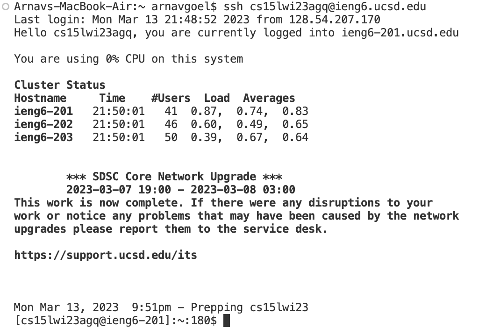
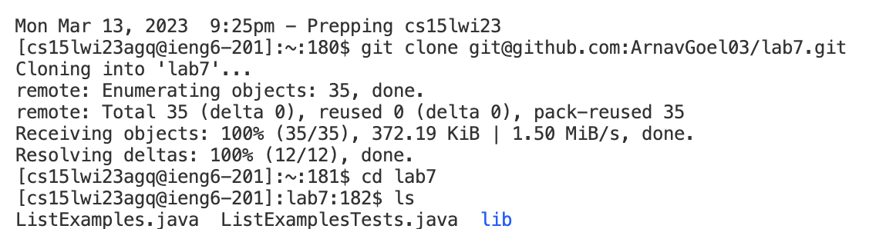
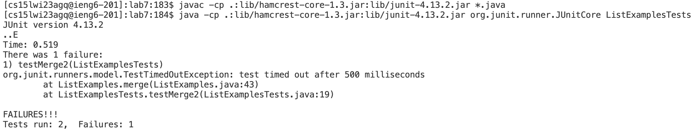
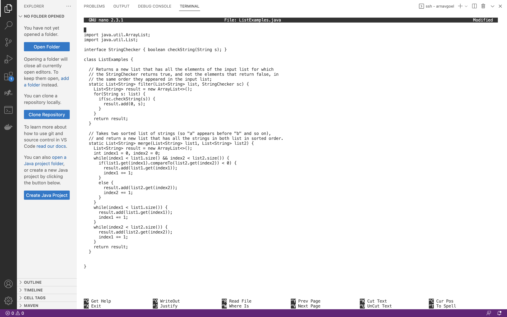
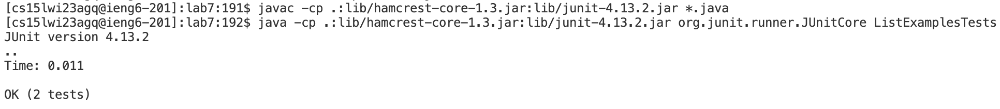
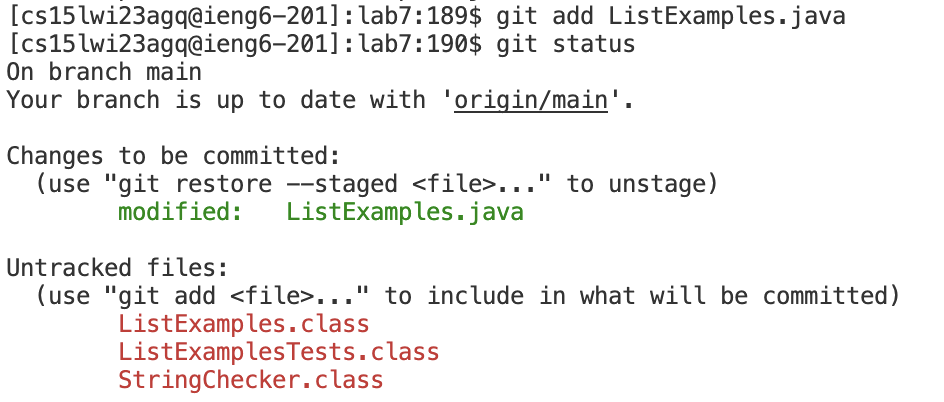
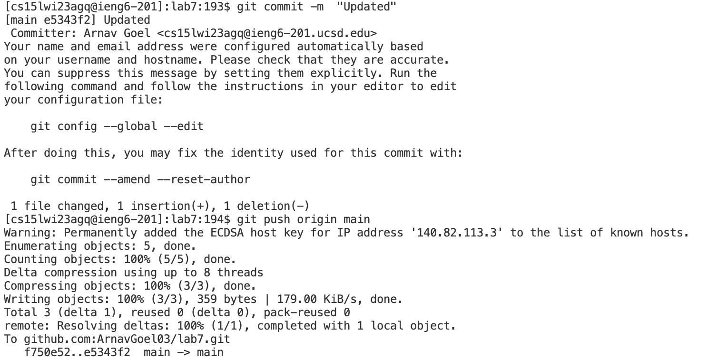

# Fixing the file using the command line tools on remote server

## Setup ~ 
- Step 1 - Setup Delete any existing forks of the repository you have on your account
- Step 2 - Setup Fork the repository
- Step 3 - Starting the timer!

## Step 4 - Log into ieng6

Keys pressed - Typed ssh <up><enter>
  
The account for the remote server 'cs15lwi23agq@ieng6.ucsd.edu' was in the history as I have been using the same account with 'ssh' for a while now. So, I used the up arrow once to access it. I didn't had to enter my password as I already did authetication using ssh keys as suggested in the instructions.

## Step 5 - Clone your fork of the repository from your Github account

 
Keys pressed - <up><up><up><up><up><up><up><up><up><up><up><up><up><up><up><up><up><enter>
  
I command to clone the fork of the repository from github was 17 up in the search history, so I used up arrow to access it. During the inital run, I copied the url to clone from the local section of the repository which has a special url for ssh keys.

## Step 6 - Run the tests, demonstrating that they fail

  
Keys pressed: <up><enter>, <up><up><up><up><up><up><enter>

The javac -cp .:lib/hamcrest-core-1.3.jar:lib/junit-4.13.2.jar *.java command was 1 up in the search history, so I used up arrow to access it. Then the java -cp .:lib/hamcrest-core-1.3.jar:lib/junit-4.13.2.jar org.junit.runner.JUnitCore ListExamplesTests command was 6 up in the history, so I accessed and ran it in the same way. One of the tests passed but the other one failed.

## Step 7 - Edit the code file to fix the failing test

  
Keys pressed - Type 'Nano L' <tab> type '.j' <tab> <enter>, make the desired changes, Ctrl+O <enter> Ctrl+X

I edited the java file using the Nano command but since there were similar files names starting with L, I took advantage of it by autofilling using the tab key. But there was also a class file and a test file with similar names so I had to type '.j' and then used 'tab' key again to autofill. 

After that a editor window popped up using which I edited the file and closed it by using Ctrl+X. I made sure to save the file by using Ctrl+O and enter key before closing it.
  

## Step 8 -  Run the tests, demonstrating that they now succeed

  
Keys pressed - &ltup&lt <up><up><enter>, <up><up><up><enter>
  
The javac -cp .:lib/hamcrest-core-1.3.jar:lib/junit-4.13.2.jar *.java command was 3 up in the search history, so I used up arrow to access it. Then the java -cp .:lib/hamcrest-core-1.3.jar:lib/junit-4.13.2.jar org.junit.runner.JUnitCore ListExamplesTests command was 3 up in the history, so I accessed and ran it in the same way. Due to the new modifications to the java file, both of the tests successfully pass.
  

## Step 9 - Commit and push the resulting change to your Github account

  
Keys pressed - <up><up><up><up><up><enter>, typed 'git status', <up><up><up><up><up><up><enter>, <up><up><up><up><up><up><enter>
  
The commands 'git add'
