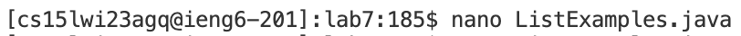

# Fixing the file using the command line tools on remote server

## Setup ~ 
- Step 1 - Setup Delete any existing forks of the repository you have on your account
- Step 2 - Setup Fork the repository
- Step 3 - Starting the timer!

## Step 4 - Log into ieng6

Keys pressed - Typed ssh <up><enter>
  
The account for the remote server 'cs15lwi23agq@ieng6.ucsd.edu' was in the history as I have been using the same account with 'ssh' for a while now. So, I used the up arrow once to access it. I didn't had to enter my password as I already did authetication using ssh keys as suggested in the instructions.

## Step 5 - Clone your fork of the repository from your Github account

 
Keys pressed - <up><up><up><up><up><up><up><up><up><up><up><up><up><up><up><up><up><enter>
  
I command to clone the fork of the repository from github was 17 up in the search history, so I used up arrow to access it. During the inital run, I copied the url to clone from the local section of the repository which has a special url for ssh keys.

## Step 6 - Run the tests, demonstrating that they fail

  
Keys pressed: <up><up><up><up><enter>, <up><up><up><up><enter>

The javac -cp .:lib/hamcrest-core-1.3.jar:lib/junit-4.13.2.jar *.java command was 4 up in the search history, so I used up arrow to access it. Then the java -cp .:lib/hamcrest-core-1.3.jar:lib/junit-4.13.2.jar org.junit.runner.JUnitCore command was 4 up in the history, so I accessed and ran it in the same way.

## Step 7 - Edit the code file to fix the failing test

  
Keys pressed - Type 'Nano L' <tab> type '.j' <tab> <enter>, make the desired changes, Ctrl+O <enter> Ctrl+X
  

## Step 8 -  Run the tests, demonstrating that they now succeed

  
Keys pressed -

## Step 9 - Commit and push the resulting change to your Github account

  
Keys pressed -
